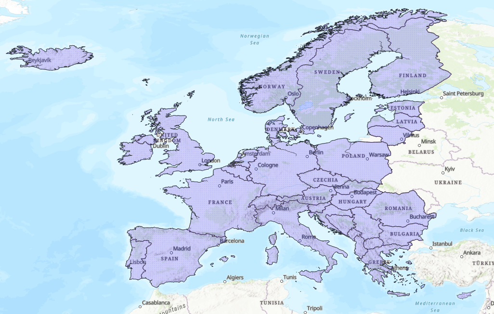
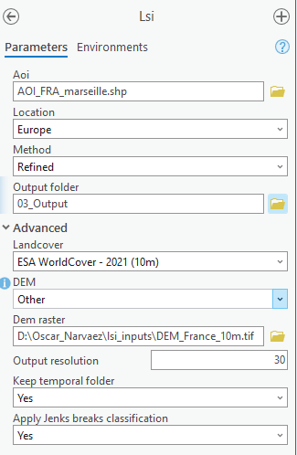

# LSI

> :warning: **CONDA ENVIRONMENT**  
> **Make sure your ArcGIS Pro conda environment is properly installed.**  
> For more information: [ArcGIS Pro EO](https://lab.egeos-services.it/bitbucket/projects/CPP/repos/arcgis-pro-eo/browse).

## Description

Computes de Landslide Susceptibility Index (LSI) based on the P17-Post-disaster landslide methodology. 
This Index is estimated by a combination of data sources that includes the assesment of terrain, geomorphology and lithotypes, such as the following:

* Geology/Lithology
* Terrain Slope
* Slope Aspect
* Elevation
* Land use and land cover (LULC)
* Distance from drainage network

There are two available methods (Global and Europe).

The Global method is based on the use of all previous data sources, the Europe method on the other side only considers the following data:
* Geology/Lithology
* Terrain Slope
* Land use and land cover (LULC)

> The Global method is based on a multi-criteria analysis for landslide suceptibility available at:
> : [(Vojteková et al. 2020)](https://www.tandfonline.com/doi/full/10.1080/19475705.2020.1713233)

> The Europe method uses the division by Climate-physiographically differentiated zones used for the susceptibility ELSUS map.
> For more information: [(Gunther et al. 2014)](https://publications.jrc.ec.europa.eu/repository/handle/JRC91935)


The minimum requirement for the LSI calculation is:
* AOI
* Output path

with a DEM and a Landcover already set as default.

> :information_source: **Note to consider:**
>  Is important to bare in mind that the *European method* does not comprise overseas departments and regions such as the Madeira Island for Portugal, Guyane or La Réunion for France or even Ceuta for Spain (just to mention a few), with the single exception of the **Faroes Islands (Denmark)**. On the other side, countries like **Cyprus**, **Malta** and **Iceland** which represent further or smaller island states are well included. Image below for reference:



> :information_source: It is also relevant to mention that the EUROPE method might be less accurate in the coastal region due to the definition of the Climate-physiographical zones, which in some cases might omit parts of the coast. The same applies for small islands, where not all the land might be covered. For these cases the GLOBAL method is best recommended.

# ArcGIS Pro inputs:

### Basic inputs

**Aoi** (mandatory)

AOI path (shapefile, geojson, kml) or WKT strings.

**Location**

Location of the AOI. Used to define a methodology.

* Europe: AOI located in Europe
* Global: AOI located outside Europe

Default: Global

**Output Folder** (mandatory)

Path to the output folder.

### Advanced

**Landcover**

Name of the Landcover that will be used, with the following options:

* Corine Land Cover - 2018 (100m)
* Global Land Cover - Copernicus 2019 (100m)
* ESA WorldCover - 2021 (10m)

Default: "ESA WorldCover - 2021 (10m)"

**DEM**

Name of the DEM to be used.

* COPDEM 30m
* FABDEM
* Other: A DEM other than those listed above. Need to be load in the "DEM raster" parameter

Default: "COPDEM 30m"

**Output resolution**

Resolution of the output raster in the unit of the output coordinate system.

Default : 30 meters

**Keep temporal folder**

A flag to confirm whether temporal files should be kept such as (lithology, slope, aspect and other layers)

Default : Yes

**Apply Jenks breaks classification**

A flag, to confirm whether a 5-class classification should be performed. If *Yes*, a 5-class lsi.tif output will be created along with a vector.

Default : Yes



## Run from the command line

This tool is also usable by command line:

```text
Usage: lsi.py [OPTIONS]

+- Options -------------------------------------------------------------------+
| *  --aoi               -aoi        PATH                 AOI (shp, geojson)  |
|                                                         or WKT string       |
|                                                         [required]          |
|    --location          -loc        [Europe|Global]      Location of the AOI |
|                                                         [default: Global]   |
|    --dem_name          -dem        [COPDEM              DEM Name needed     |
|                                    30m|FABDEM|Other]    [default: COPDEM    |
|                                                         30m]                |
|    --other_dem         -demp       PATH                 DEM path if dem =   |
|                                                         Other               |
|    --landcover_name    -lulc       [ESA WorldCover -    Land Cover Name     |
|                                    2021 (10m)|Corine    [default: ESA       |
|                                    Land Cover - 2018    WorldCover - 2021   |
|                                    (100m)|Global Land   (10m)]              |
|                                    Cover - Copernicus                       |
|                                    2019 (100m)]                             |
|    --europe_method     -eu_method  [Refined|Fast]       if LOCATION =       |
|                                                         EUROPE, choose      |
|                                                         whether you want a  |
|                                                         fast computation    |
|                                                         with lower          |
|                                                         resolution (based   |
|                                                         on the pre-existent |
|                                                         ELSUS layer) or a   |
|                                                         refined LSI         |
|                                                         computation         |
|                                                         [default: Refined]  |
|    --output_resolution  -res        INTEGER RANGE       Output resolution.  |
|                                    [1<=x<=1000]         Taking from DEM if  |
|                                                         not provided        |
|                                                         [default: 10;       |
|                                                         1<=x<=1000]         |
|    --epsg_code         -epsg       INTEGER RANGE        EPSG code, 4326 is  |
|                                    [1024<=x<=32767]     not accepted. By    |
|                                                         default, it is the  |
|                                                         EPSG code of the    |
|                                                         AOI UTM zone.       |
| *  --output_path       -out        DIRECTORY            Output directory.   |
|                                                         [required]          |
|    --ftep                                               Set this flag if    |
|                                                         the command line is |
|                                                         run on the ftep     |
|                                                         platform.           |
|                                                         [default: False]    |
|    --temp                                               Set this flag False |
|                                                         if you don't want   |
|                                                         to keep temporary   |
|                                                         files (geology,     |
|                                                         aspect, slope,      |
|                                                         etc).               |
|                                                         [default: True]     |
|    --jenks                                              Set this flag if    |
|                                                         you want to apply a |
|                                                         jenks breaks into 5 |
|                                                         LSI classes (It     |
|                                                         might run for       |
|                                                         longer time as it's |
|                                                         an expensive        |
|                                                         computation).       |
|                                                         [default: True]     |
|    --help              -h                               Show this message   |
|                                                         and exit.           |
+-----------------------------------------------------------------------------+
```


Example for running the tool from the command line:

Simplest scenario (the following line will provide a simple LSI raster with the GLOBAL method and the default DEM and LULC for the AOI provided, with 5-classes and the LSI shapefile)

```shell
python lsi.py -aoi "\\path\to\aoi_Bizou_Normandy.shp" -out "\\path\to\output_folder"
```


Global

```shell
python lsi.py -aoi "\\path\to\aoi_Caracas.shp" -loc "Global" -dem "COPDEM 30m" -lulc "ESA Worldcover - 2021 (10m)" -res 30 -out "\\path\to\output_folder" --jenks True
```

Europe

```shell
python lsi.py -aoi "\\path\to\aoi_Souffelweyersheim_BashRhin.shp" -loc "Europe" -dem "COPDEM 30m" -lulc "Corine Land Cover - 2018 (100m)" -eu_method "Refined" -res 30 -out "\\path\to\output_folder" --temp False --jenks False
```


